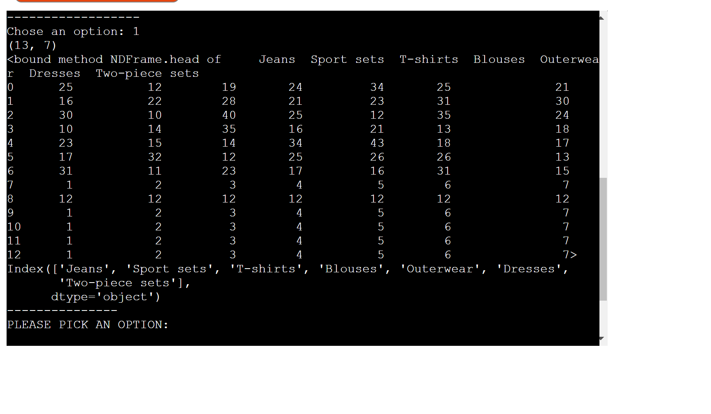

# NewYork Fashion Store


## Introduction

This project was created in order for small businesses to easily keep track of their clothes in store, in warehouse and how many have been selled.

### Site Goals

* Provide a simple application to allow the site owner to keep track of sales and clothes from the warehouse and store.

### Target Audience

* Small clothes stores that want to keep track of stock and sales.

### User Stories

* As a User, I would like to be able to manage my store so that I can easily keep track of what clothes have been selled.
* As a User, I would like to have an error message in red color if I have made an mistake in my numbers.
* As a user, after an error message I want to be able to write again the numbers without closeing and reopening the app again.
* As a user, I would like to receive a message in green colour that the spreadsheets have updated succesfully.

### Features Planned

* To add an resut for the whole year
* To add more designs for this app so that the user can choose witch one he likes.
* To add a dark or light mode  

## Structure

### Features

USER STORY

`
As a User, I would like to be able to manage my store so that I can easily keep track of what clothes have been selled.
`

IMPLEMENTATION

Through this app the user can keep track of his store. When he write in the app the numbers the user can see every sales numbers,  warehouse numbers and store numbers already calculated.

USER STORY

`
As a User, I would like to have an error message in red color if I have made an mistake in my numbers.
`

IMPLEMENTATION

When the user don't write enough numbers, separated bu commas or if he will write a letter the app will give him an error message in red colour so that the user could see better that there is a problem.


USER STORY

`
As a user, after an error message I want to be able to write again the numbers without closeing and reopening the app again.
`

IMPLEMENTATION

When the user will receive an error message , he can start again to write the numbers and he dont need to start the app again or to refresh the app.


USER STORY

`
As a user, I would like to receive a message in green colour that the spreadsheets have updated succesfully.
`

IMPLEMENTATION

After the user added the sales numbers the user will see a green message for every spreadsheet that have been successfuly updated.


## Logical Flow


## Technologies

* Python - Python was the main language used to build the application.

* Screen-o-matic - This was used to screen record the Gif for the readme. It was originally an MP4 and ezgif.com was used to convert to GIF format.

* Google Spreadsheets

## Testing

### Functional Testing

Below are the test execution of positive functional tests:

When the user will acces the app, he will have some welcome message and after the welcome message will be a menu with 4 options.

 First option is for instructions. After the instructions the user will have to choose again if he want to add sales data or to see the menu again.
 
The second option from the menu is for the user to see the sheet. If he choose the second option, he will have to choose again, but this time the user will have to choose witch file from the sheet wants to see.

When the user will choose one of this 3 options, he will be able to see a table .

Under the table the menu will appear again.


If the user will choose the third option from the menu, he wull be able to add sales data.

When the user add sales data will be informed that everything eas succesfully updated.


After the update the menu will appear again.

The fourth option is for exiting the app. I the user will choose this option will have a goodbye message.


### Pep8 Validation

All python code was ran through pep8online.com validator and any warnings or errors were fixed. Code then validated successfully.


### Lighthouse


### Bugs and Fixes

When I tested my code through Pep8 Validation, it gave me an error that one of the lines is too long, so I made it shorter and I didn't have any other errors.

## Deployment

### Version Control
The site was created using the Codeanywhere editor.

The following git commands were used throughout development to push code to the remote repo:

```git add <file>``` - This command was used to add the file(s) to the staging area before they are committed.

```git commit -m “commit message”``` - This command was used to commit changes to the local repository queue ready for the final step.

```git push``` - This command was used to push all committed code to the remote repository on github.

### Heroku Deployment

The below steps were followed to deploy this project to Heroku:

* Go to Heroku and click "New" to create a new app.
* Choose an app name and region region, click "Create app".
* Go to "Settings" and navigate to Config Vars. Add the following config variables:
    * PORT : 8000
* Navigate to Buildpacks and add buildpacks for Python and NodeJS (in that order).
* Navigate to "Deploy". Set the deployment method to Github and enter repository name and connect.
* Scroll down to Manual Deploy, select "main" branch and click "Deploy Branch".
* The app will now be deployed to heroku

## Credits

### Code

* W3C tutorials were used as a reference for python functions throughout this project.

* I have used as a reference from this course

* I thank the mentor and the Tutor Assistants for their help and time.

* I thank the family for their support

