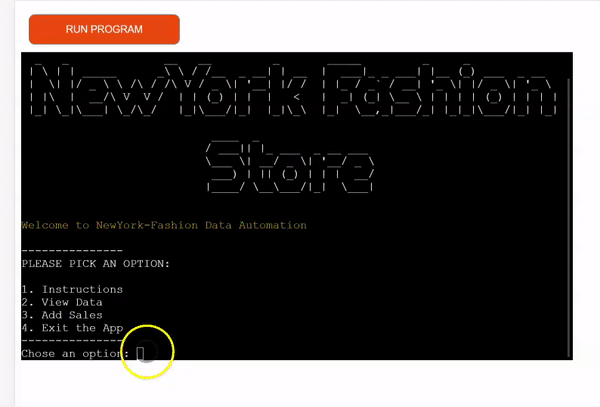

# NewYork Fashion Store

TESTING

## Introduction

This project was created in order for small businesses to easily keep track of their clothes in store, in warehouse and how many have been selled.

### Site Goals

* Provide a simple application to allow the site owner to keep track of sales and clothes from the warehouse and store.

### Target Audience

* Small clothes stores that want to keep track of stock and sales.

### User Stories

* As a User, I would like to be able to manage my store so that I can easily keep track of what clothes have been selled.
* As a User, I would like to have an error message in red color if I have made an mistake in my numbers.
* As a user, after an error message I want to be able to write again the numbers without closeing and reopening the app again.
* As a user, I would like to receive a message in green colour that the spreadsheets have updated succesfully.

### Features Planned

* To add an resut for the whole year
* To add more designs for this app so that the user can choose witch one he likes.
* To add a dark or light mode  

## Structure

### Features

USER STORY

`
As a User, I would like to be able to manage my store so that I can easily keep track of what clothes have been selled.
`

Through this app the user can keep track of his store. When he write in the app the numbers the user can see every sales numbers,  warehouse numbers and store numbers already calculated.

USER STORY

`
As a User, I would like to have an error message in red color if I have made an mistake in my numbers.
`

When the user don't write enough numbers, separated bu commas or if he will write a letter the app will give him an error message in red colour so that the user could see better that there is a problem.

USER STORY

`
As a user, after an error message I want to be able to write again the numbers without closeing and reopening the app again.
`

When the user will receive an error message , he can start again to write the numbers and he dont need to start the app again or to refresh the app.

USER STORY

`
As a user, I would like to receive a message in green colour that the spreadsheets have updated succesfully.
`

After the user added the sales numbers the user will see a green message for every spreadsheet that have been successfuly updated.

